<p align="center">
  
</p>

# Phoenix City

[](LICENSE)
[](plugins/agent-city)
[](https://claude.com/claude-code)

An agent marketplace for [Claude Code](https://claude.com/claude-code). It ships one
plugin: **Agent City** — a group of agents that work together like a city to take a
single command and turn it into a GitHub pull request with passing checks. Code written,
tested, pushed, and looked after until it's green.

It works where real work happens: your existing repo. The engineer surveys the codebase
before writing anything, new code follows the house conventions, and the inspector runs
your existing suite alongside the tests it writes — a change that breaks old behavior is
a failed inspection, full stop. Green-field projects work too; they're just the easy
case.

The pipeline never merges to main. It gets your work to a passing PR; clicking merge is
your job. And the name isn't decoration — when a test fails or a reviewer rejects the PR,
the run doesn't die. The failure gets diagnosed, routed back, and the city rebuilds from
it. That's the phoenix part.

## Install

```
/plugin marketplace add ruhaans05/claude-phoenix-skills-marketplace
/plugin install agent-city@phoenix-city
```

Then give the Mayor a job:

```
/phoenix build me a URL shortener with Postgres — keep going until the PR passes
```

That's the whole interface. (Plain prose works too — "build me X" without the slash
command reaches the Mayor the same way.) Once the pipeline starts, it only comes back to
you for two things: database details (credentials, hosting, engine preference) and
confirmation before anything destructive. Everything else it decides and discloses in
the final report.

Two commands cover the lifecycle:

| Command | What it does |
|---------|--------------|
| `/phoenix <job>` | Start the pipeline — or resume one in flight on the current branch |
| `/city-status` | Read-only: which phase, PR + live check status, what's red, next action |

New to multi-agent systems, or want to understand how this one is put together before
running it? Read [the guide](GUIDE.md) — it teaches how a city of agents works, start to
finish, using this one as the worked example.

## The agents

**The Mayor** is the orchestrator. It parses your command into a work order, runs the
pipeline phase by phase, routes every failure to the right place, and is the only agent
allowed to declare the run done. Its skills: `intake` (command → work order),
`city-charter` (the pipeline's rules — phase order, failure routing, iteration bounds),
and `city-ledger` (the run's record — see below).

The other four are the executive agents. Each owns a phase:

- **city-engineer** writes the code. `blueprint` surveys the existing codebase read-only
  and produces a plan; `construct` builds it in small increments, sanity-checking each
  one. It's also the repair bay — every red test and rejected review lands back here with
  a diagnosis attached.

- **city-inspector** writes and runs the tests. `test-forge` produces unit tests for each
  new behavior, integration tests for the seams, and at least one end-to-end test that
  makes your definition of done executable (every test is watched failing first, so green
  actually means something). `test-run` runs the full suite — new tests plus whatever
  already existed — and triages each failure into a root cause the engineer can act on.

- **city-courier** handles delivery. `pr-open` branches off the default branch, commits
  cleanly, sweeps the diff for anything credential-shaped, pushes, and opens the PR with
  a description traceable to real runs. `pr-steward` then manages the PR's life: polls
  CI, reads the actual failure logs rather than guessing from check names, reads review
  rejections for their reasoning, fixes mechanical problems itself, and routes
  substantive ones back through the pipeline.

- **city-archivist** is the database agent, and it stays home unless the build needs
  persistence — either you named a database in the prompt, or another agent hit a real
  need for one mid-run. `db-consult` is the pipeline's single sanctioned interruption: it
  batches every question it has (engine, hosting, credentials, API keys) into one
  exchange so it never has to come back. `db-provision` then sets it up — schema as
  committed migrations, app wired through one seam, `.env` gitignored with a committed
  `.env.example` — and proves it with a real write-and-read-back before reporting done.

## The pipeline

```
your command
  └─► intake          work order: what, done-means, DB?, iterate?, cap
  └─► db-consult      only if a DB is named or inferred  ← the one user interruption
  └─► blueprint       design against the existing code
  └─► construct       build it
  └─► db-provision    only if the consult ran
  └─► test-forge      write the tests
  └─► test-run ──red────► construct (with diagnosis)     ┐
  └─► pr-open         feature branch → push → PR          │  loops until green,
  └─► pr-steward ──red──► construct (with analysis)       ┘  capped (default 5)
  └─► final report    PR URL, real test numbers, check status, what remains
```

The loop is bounded: five full iterations by default, or whatever cap you set in the
prompt. It also stops early if two consecutive iterations fix nothing — a plateau gets
reported, not ground against. And if you say "just open the PR, don't loop", it does one
pass and reports the PR's true state, red or not.

A few rules hold no matter what:

1. Never merge to main. Green checks don't change this.
2. Never report unverified results — test counts come from real runs, check statuses
   from real polls.
3. Never widen scope past the work order.
4. Never dress up a failure as a success. Caps, plateaus, and blocks end with an honest
   report.

### The ledger — resumable runs, auditable PRs

Every run keeps `.agent-city/ledger.md` on the feature branch: the work order verbatim,
one line per phase transition, every decision made by convention, and an always-current
Status block. Two things fall out of that file:

- **Your session can end mid-run.** Come back tomorrow, type `/phoenix` on the branch, and
  the Mayor verifies the ledger against git and GitHub, then continues from where it
  actually stopped — completed phases are never re-run.
- **Your reviewer gets the full account.** The ledger rides in the PR diff, so whoever
  reviews can see what was asked, what was decided, which tests failed along the way and
  how they were diagnosed. It dies with the branch if the PR is rejected.

Don't want it? Say "no ledger" in the prompt.

## Examples

```
# feature in an existing repo — the common case
/phoenix add CSV export to the reports page, follow the existing download patterns

# full autonomous run, green-field
/phoenix build me a REST API for a todo app with auth, keep going until the PR is green

# database named up front — archivist consults before construction starts
/phoenix build a waitlist signup page backed by Supabase

# one pass, no iteration
/phoenix add rate limiting to the API and just open the PR — don't loop on CI

# custom iteration budget
/phoenix build a markdown blog engine, cap it at 3 iterations

# next morning, on the same branch
/phoenix          # resumes from the ledger
/city-status     # or just ask where things stand
```

## Repo layout

```
.claude-plugin/marketplace.json        # the Phoenix City marketplace
plugins/agent-city/
├── .claude-plugin/plugin.json
├── commands/
│   ├── phoenix.md                     # /phoenix — start or resume the pipeline
│   └── city-status.md                 # /city-status — read-only run report
├── agents/
│   ├── mayor.md                       # orchestrator
│   ├── city-engineer.md               # code
│   ├── city-inspector.md              # tests
│   ├── city-courier.md                # PR / delivery
│   └── city-archivist.md              # database (conditional)
└── skills/
    ├── city-charter/  intake/  city-ledger/   # mayor
    ├── blueprint/     construct/              # engineer
    ├── test-forge/    test-run/               # inspector
    ├── pr-open/       pr-steward/             # courier
    └── db-consult/    db-provision/           # archivist
```

Each skill is a `SKILL.md` (the model-facing contract) plus a `README.md` (the
human-facing explainer). Want to add a new department to the city, or a new skill to an
existing agent? See [CONTRIBUTING.md](CONTRIBUTING.md).

## Roadmap

- [x] Agent City v1 — Mayor + four executive agents, one command to a passing PR
- [x] v1.1 — `/phoenix` + `/city-status` commands, and the ledger: resumable runs,
      reviewer-auditable PRs ([CHANGELOG](CHANGELOG.md))
- [ ] City Planner — a review agent that critiques the blueprint before construction
- [ ] Night Watch — scheduled stewardship, tending open PRs after the session ends
- [ ] More districts: observability, performance, security audit

## Privacy & license

Agent City is plain text — Markdown agent definitions, skill files, JSON manifests. It
runs locally inside Claude Code, makes no network calls of its own, and collects nothing.
Anything the pipeline does (pushing branches, opening PRs, connecting to a database)
happens on your machine with your own credentials. Details in [PRIVACY.md](PRIVACY.md).

MIT licensed — see [LICENSE](LICENSE).
